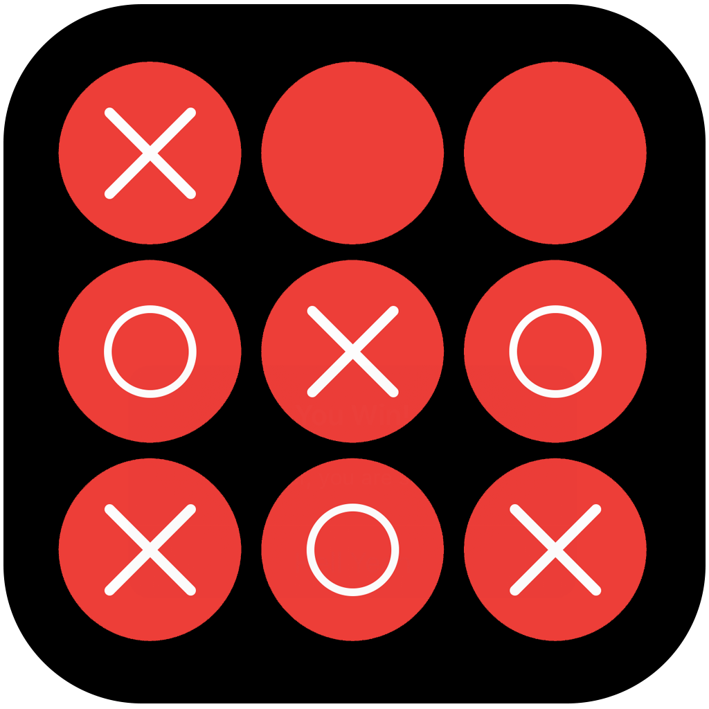

# eXandOs

{:height="200px" width="200px"}
###### iOS App

### This is the official eXandOs support website.
- You can read the privacy policy here: [Privacy Policy](https://exandos.github.io/Privacy-Policy/).
- Contact me here as wel, at <exandos@outlook.com>.

#### Developer Info
This iOS App is created by **Giordano Menegazzi**, an individual **iOS Developer** from the Netherlands. 

- [LinkedIn](https://www.linkedin.com/in/giordano-menegazzi-35108012a/)

#### App Background
This App is created as personal portfolio App, to practice with the new Apple framework **SwiftUI** and the implementation of Google AdMob SDK.

Next to that I experimented with Apples own **SF symbols, ColorPicker, Shake Gesture, @Environment, @Published, @AppStorage and Observable objects**
to mention a couple key components I wanted to experiment with within **SwiftUI**.

This is the first "Game" app i created, so better to start simple :).

If you got any suggestions for new features or found any bugs in the app please don't hesitate to contact me at <exandos@outlook.com>.

## I hope you enjoy the App!

Greetings,

**Giordano Menegazzi**

